# Architecture

Technical documentation for the Fun Games platform.

## Tech Stack

| Technology | Version | Purpose |
|-----------|---------|---------|
| React | 19 | UI framework |
| Vite | 7 | Build tool and dev server |
| Tailwind CSS | 4 | Utility-first styling |
| TypeScript / JavaScript | - | Both used (newer games use TS) |
| React Router DOM | 7 | Client-side routing |
| Framer Motion | 12 | Animations |
| Lucide React | 0.562 | Icons |
| Express | 5 | Production server |
| Vitest | 3 | Test runner |
| React Testing Library | 16 | Component testing |
| ESLint | 9 | Linting |
| PropTypes | 15 | Runtime type checking (JS games) |

## Application Architecture


Each game is a fully isolated route. Games share no state with each other — only the `ErrorBoundary` and `localStorage` are shared infrastructure.

## Project Structure

```
src/
├── main.jsx                    # App entry point (router setup)
├── index.css                   # Global styles (Tailwind imports)
├── App.css                     # App-level styles
├── setupTests.js               # Vitest configuration
├── pages/
│   └── Home.jsx                # Home page with game selector grid
├── components/
│   └── ErrorBoundary.jsx       # Shared error boundary (wraps all routes)
├── games/
│   ├── golf/                   # Golf card game (JavaScript)
│   ├── race/                   # Race game (TypeScript)
│   ├── dots/                   # Dots and Boxes (JavaScript)
│   ├── checkers/               # Checkers (JavaScript)
│   ├── archerfish/             # Archer Fish (TypeScript)
│   └── battleplanes/           # Battle Planes (TypeScript)
├── types/
│   └── race/index.ts           # Shared type definitions
├── constants/
│   └── race/index.ts           # Shared constants
├── utils/
│   └── score.js                # Golf scoring utilities
├── assets/                     # Images, SVGs, game assets
└── test/
    └── gameTestHelpers.js      # Shared test utilities
```

## Routing

Defined in `src/main.jsx`. Each game is a top-level route with its own isolated state:

```mermaid
graph LR
    Home["🏠 Home<br/>(/)"] --> Golf["⛳ Golf<br/>(/golf)"]
    Home --> Race["🏎️ Race<br/>(/race)"]
    Home --> Dots["🔲 Dots<br/>(/dots)"]
    Home --> Checkers["👑 Checkers<br/>(/checkers)"]
    Home --> Archer["🐠 Archer Fish<br/>(/archerfish)"]
    Home --> Battle["✈️ Battle Planes<br/>(/battleplanes)"]

    Golf -->|← Home| Home
    Race -->|← Home| Home
    Dots -->|← Home| Home
    Checkers -->|← Home| Home
    Archer -->|← Home| Home
    Battle -->|← Home| Home

    style Home fill:#f0fdf4,stroke:#14532d
```



All routes are wrapped in a shared `ErrorBoundary` component. Each game provides a fixed-position Home button (top-left) to navigate back.

## Game Architecture

### Three-Phase Lifecycle

Every game follows a **Setup → Playing → Results** state machine pattern:


**Implementation pattern:**

```jsx
const [gamePhase, setGamePhase] = useState('setup');

if (gamePhase === 'setup') return <SetupScreen onStart={...} />;
if (gamePhase === 'playing') return <GameScreen onEnd={...} />;
if (gamePhase === 'results') return <ResultsScreen onPlayAgain={...} />;
```

#### Per-Game State Variations

While all games follow the same three-phase pattern, they use slightly different state names:


### Per-Game Directory Structure

Each game directory follows this layout:

```
games/{gameName}/
├── {GameName}Game.tsx/.jsx     # Main entry (state machine wrapper)
├── types.ts                    # Type definitions (TS games)
├── components/
│   ├── SetupScreen.tsx         # Configuration phase
│   ├── GameScreen.tsx          # Playing phase
│   ├── EndScreen.tsx           # Results phase
│   └── [EntityComponents]      # Game-specific UI
├── game/                       # Game engine (canvas-based games)
│   ├── GameEngine.ts           # Core simulation logic
│   ├── Car.ts / Track.ts       # Entity logic and rendering
│   └── ...
├── hooks/
│   └── useGameState.js         # State management (hook-based games)
├── utils/
│   ├── aiLogic.js/.ts          # AI opponent logic
│   ├── physics.ts              # Physics/collision (action games)
│   └── ...
├── constants/
│   └── index.js/.ts            # Game-specific constants
└── assets/                     # Game-specific images
```

## State Management

No external state management libraries. All state is managed with React hooks. The project uses two distinct approaches depending on game type:


### Approach 1: Hook-Based State (Turn-Based Games)

Used by **Golf**, **Checkers**, and **Dots and Boxes**.

A custom `useGameState` hook encapsulates all game logic:

```jsx
// hooks/useGameState.js
export function useGameState() {
  const [board, setBoard] = useState(initialBoard);
  const [currentPlayer, setCurrentPlayer] = useState(0);
  // ... 20+ state variables
  // ... game logic functions
  return { board, currentPlayer, makeMove, ... };
}
```

The main game component destructures the hook and renders UI:

```jsx
function CheckersGame() {
  const { board, currentPlayer, makeMove, ... } = useGameState();
  return <GameBoard board={board} onMove={makeMove} />;
}
```

### Approach 2: Component + Game Loop (Real-Time Games)

Used by **Race**, **ArcherFish**, and **Battle Planes**.

The main component manages configuration and phase transitions. A separate canvas or game screen component runs a `requestAnimationFrame` loop:

```tsx
// components/RaceCanvas.tsx
const gameLoop = useCallback((timestamp: number) => {
  const deltaTime = timestamp - lastTimeRef.current;
  lastTimeRef.current = timestamp;

  // Clear canvas
  ctx.clearRect(0, 0, canvas.width, canvas.height);

  // Update physics
  const { cars: updatedCars, finished } = updateRaceState(
    currentCars, deltaTime, inputs, targetLaps
  );

  // Draw entities
  currentCars.forEach(car => drawCar(ctx, car, position, rotation));

  animationRef.current = requestAnimationFrame(gameLoop);
}, [dependencies]);
```

**Key patterns:**
- Delta time tracking via refs (`lastTimeRef.current`)
- `useRef` for mutable state that shouldn't trigger re-renders (pressed keys, animation frame IDs)
- `useCallback` memoization for the game loop
- Cleanup with `cancelAnimationFrame` in `useEffect` return

## Rendering Approaches

The project uses two rendering strategies based on game requirements:

```mermaid
graph TB
    subgraph "Canvas Rendering (Real-Time Games)"
        direction TB
        C1["Race: Full Canvas"] --> C2["Single &lt;canvas&gt; element"]
        C2 --> C3["ctx.clearRect() every frame"]
        C3 --> C4["Draw track → Draw cars"]

        C5["ArcherFish / BattlePlanes: Hybrid"] --> C6["DOM container + positioned divs"]
        C6 --> C7["Game loop updates React state"]
        C7 --> C8["React re-renders entity components"]
    end

    subgraph "DOM Rendering (Turn-Based Games)"
        direction TB
        D1["Golf / Checkers / Dots"] --> D2["React components for everything"]
        D2 --> D3["CSS Grid / Flexbox layouts"]
        D3 --> D4["Framer Motion / CSS transitions"]
        D4 --> D5["onClick / onDrag handlers"]
    end

    style C1 fill:#fef3c7,stroke:#d97706
    style C5 fill:#fef3c7,stroke:#d97706
    style D1 fill:#dbeafe,stroke:#2563eb
```



### Canvas API (Action/Physics Games)

**Race** uses a single `<canvas>` element with manual drawing:
- Track drawn with paths, fills, and strokes
- Cars drawn with `ctx.save()` / `ctx.translate()` / `ctx.rotate()` / `ctx.restore()`
- Full clear-and-redraw each frame

**ArcherFish** and **Battle Planes** use a hybrid approach:
- Background/arena rendered as React components or divs
- Entities (fish, robots, planes) rendered as positioned React components
- Game loop updates state, React re-renders components

### React DOM Components (Turn-Based Games)

**Golf**, **Checkers**, and **Dots** render everything as React components:
- Board grids as CSS grid or flex layouts
- Pieces/cards as styled divs or SVG elements
- Animations via Framer Motion or CSS transitions
- Click/drag handlers directly on elements

## Game Loop (Real-Time Games)

The real-time games use a `requestAnimationFrame`-based game loop with delta time for frame-rate independent updates:


## AI Implementations

Each game implements its own AI logic. No shared AI framework.


| Game | Approach | File |
|------|----------|------|
| Checkers | Minimax with alpha-beta pruning | `games/checkers/utils/aiLogic.js` |
| Golf | Statistical (expected value of unknown cards) | `games/golf/hooks/useGameState.js` |
| Dots | Best-move heuristic (box completion priority) | `games/dots/utils/aiLogic.js` |
| Race | Simple speed targeting with lane correction | `games/race/game/GameEngine.ts` |
| ArcherFish | Behavior-based (evade robots, navigate obstacles) | `games/archerfish/utils/ai.ts` |
| Battle Planes | Enemy planes follow predefined flight paths | `games/battleplanes/components/GameScreen.tsx` |

## Input Handling

The Race game demonstrates the most complex input handling, merging multiple input sources:


### Multi-Player Keyboard (Race)

Four control schemes defined in `src/constants/race/index.ts`:

| Player | Accelerate | Brake | Left | Right |
|--------|-----------|-------|------|-------|
| 1 | W / Space / ArrowUp | S / ArrowDown | A / ArrowLeft | D / ArrowRight |
| 2 | ArrowUp | ArrowDown | ArrowLeft | ArrowRight |
| 3 | I | K | J | L |
| 4 | Numpad8 | Numpad5 | Numpad4 | Numpad6 |

Input is tracked via a `Set<string>` ref of pressed key codes, polled each frame.

### Touch Controls (Race)

On-screen buttons rendered as React components. Touch inputs merged with keyboard inputs via `getCombinedInputs()`.

### Mouse (Battle Planes)

Mouse position for aiming, click to fire.

### Click/Tap (Golf, Checkers, Dots)

Direct element interaction via React `onClick` handlers.

## Styling

### Approach

The project uses a hybrid styling strategy:

1. **Inline styles** for dynamic theming, positioning, and game-specific visuals
2. **Tailwind CSS utilities** for common layout patterns (flex, grid, padding, etc.)
3. **CSS files** for animations (card flips in Golf)
4. **Framer Motion** for declarative animations (Checkers piece movement)

No CSS-in-JS libraries (styled-components, Emotion, etc.) are used.

### Dark Mode Pattern


Games that support dark mode use a consistent pattern:

```jsx
const [darkMode, setDarkMode] = useState(() => {
  const saved = localStorage.getItem('{gameName}:darkMode');
  return saved ? JSON.parse(saved) : false;
});

const theme = {
  light: { background: '#f8f6f1', text: '#222', ... },
  dark: { background: '#1a202c', text: '#e5e5e5', ... },
};

const currentTheme = darkMode ? theme.dark : theme.light;
```

### Common UI Elements

**Home Button:** Fixed top-left, present on every game screen. Uses React Router `<Link to="/">`.

**Dark Mode Toggle:** Fixed top-right. Persists to localStorage.

**Setup Screen:** Card-based layout with options for player count, difficulty, game settings.

**End Screen:** Results display with "Play Again" button.

### Screen Layout

```mermaid
graph TB
    subgraph "Every Game Screen"
        direction TB
        HB["← Home<br/>(fixed top-left)"] ~~~ DM["☀/🌙 Toggle<br/>(fixed top-right)"]
        HB ~~~ Content["Game Content<br/>(Setup / Playing / Results)"]
        DM ~~~ Content
    end

    style HB fill:#f0fdf4,stroke:#14532d
    style DM fill:#fffbeb,stroke:#d97706
    style Content fill:#f8fafc,stroke:#94a3b8
```



## Persistence

All persistence uses `localStorage` with a `{gameName}:{setting}` key convention:


Only user preferences are persisted. Game state is not saved between sessions (except Golf which saves in-progress games).

## Performance Patterns


1. **Refs for non-rendering state:** Keyboard inputs, animation frame IDs, and mutable game state use `useRef` to avoid unnecessary re-renders
2. **useCallback memoization:** Game loops and event handlers are wrapped in `useCallback`
3. **Canvas batch rendering:** Clear → draw background → draw all entities in a single frame
4. **Delta time:** Physics updates use time-based deltas for frame-rate independent movement

## Naming Conventions

| Element | Convention | Example |
|---------|-----------|---------|
| React components | PascalCase | `RaceCanvas`, `GameScreen` |
| Game entry files | PascalCase + "Game" | `RaceGame.tsx`, `GolfGame.jsx` |
| Functions / variables | camelCase | `createCar`, `handleStartRace` |
| Constants | UPPER_SNAKE_CASE | `CAR_PHYSICS`, `KEYBOARD_CONTROLS` |
| Types / interfaces | PascalCase | `Car`, `GameState`, `RaceConfig` |
| Enums | PascalCase | `TrackType.Oval` |
| Boolean state | `is` / `has` prefix | `isRacing`, `isPaused`, `hasError` |
| localStorage keys | `{game}:{setting}` | `golf:darkMode` |

## Testing

- **Runner:** Vitest with jsdom environment
- **Component testing:** React Testing Library
- **Setup:** `src/setupTests.js`
- **Helpers:** `src/test/gameTestHelpers.js`
- **Test co-location:** Tests live next to their source files (`Component.test.jsx`)

Run tests:
```bash
npm run test          # Single run
npm run test:watch    # Watch mode
```
