# Architecture

Technical documentation for the Fun Games platform.

## Tech Stack

| Technology | Version | Purpose |
|-----------|---------|---------|
| React | 19 | UI framework |
| Vite | 7 | Build tool and dev server |
| Tailwind CSS | 4 | Utility-first styling |
| TypeScript / JavaScript | - | Both used (newer games use TS) |
| React Router DOM | 7 | Client-side routing |
| Framer Motion | 12 | Animations |
| Lucide React | 0.562 | Icons |
| Express | 5 | Production server |
| Vitest | 3 | Test runner |
| React Testing Library | 16 | Component testing |
| ESLint | 9 | Linting |
| PropTypes | 15 | Runtime type checking (JS games) |

## Application Architecture


Each game is a fully isolated route. Games share no state with each other — only the `ErrorBoundary` and `localStorage` are shared infrastructure.

## Project Structure

```
src/
├── main.jsx                    # App entry point (router setup)
├── index.css                   # Global styles (Tailwind imports)
├── App.css                     # App-level styles
├── setupTests.js               # Vitest configuration
├── pages/
│   └── Home.jsx                # Home page with game selector grid
├── components/
│   ├── ErrorBoundary.jsx       # Shared error boundary (wraps all routes)
│   ├── HomeButton.jsx          # Shared Home button (fixed top-left, optional darkMode prop)
│   └── DarkModeToggle.jsx      # Shared dark mode toggle (fixed top-right)
├── hooks/
│   └── useDarkMode.js          # Shared dark mode hook (localStorage persistence)
├── games/
│   ├── golf/                   # Golf card game (JavaScript)
│   ├── race/                   # Race game (TypeScript)
│   ├── dots/                   # Dots and Boxes (JavaScript)
│   ├── checkers/               # Checkers (JavaScript)
│   ├── archerfish/             # Archer Fish (TypeScript)
│   └── battleplanes/           # Battle Planes (TypeScript)
├── types/
│   └── race/index.ts           # Shared type definitions
├── constants/
│   └── race/index.ts           # Shared constants
├── utils/
│   └── score.js                # Golf scoring utilities
├── assets/                     # Images, SVGs, game assets
└── test/
    └── renderWithRouter.jsx    # Shared router wrapper for testing
```

## Routing

Defined in `src/main.jsx`. Each game is a top-level route with its own isolated state:

```mermaid
graph LR
    Home["🏠 Home<br/>(/)"] --> Golf["⛳ Golf<br/>(/golf)"]
    Home --> Race["🏎️ Race<br/>(/race)"]
    Home --> Dots["🔲 Dots<br/>(/dots)"]
    Home --> Checkers["👑 Checkers<br/>(/checkers)"]
    Home --> Archer["🐠 Archer Fish<br/>(/archerfish)"]
    Home --> Battle["✈️ Battle Planes<br/>(/battleplanes)"]

    Golf -->|← Home| Home
    Race -->|← Home| Home
    Dots -->|← Home| Home
    Checkers -->|← Home| Home
    Archer -->|← Home| Home
    Battle -->|← Home| Home

    style Home fill:#f0fdf4,stroke:#14532d
```



All routes are wrapped in a shared `ErrorBoundary` component. Each game provides a fixed-position Home button (top-left) to navigate back.

## Game Architecture

### Three-Phase Lifecycle

Every game follows a **Setup → Playing → Results** state machine pattern:


**Implementation pattern:**

```jsx
const [gamePhase, setGamePhase] = useState('setup');

if (gamePhase === 'setup') return <SetupScreen onStart={...} />;
if (gamePhase === 'playing') return <GameScreen onEnd={...} />;
if (gamePhase === 'results') return <ResultsScreen onPlayAgain={...} />;
```

#### Per-Game State Variations

While all games follow the same three-phase pattern, they use slightly different state names:


### Per-Game Directory Structure

Each game directory follows this layout:

```
games/{gameName}/
├── {GameName}Game.tsx/.jsx     # Main entry (state machine wrapper)
├── types.ts                    # Type definitions (TS games)
├── components/
│   ├── SetupScreen.tsx         # Configuration phase
│   ├── GameScreen.tsx          # Playing phase
│   ├── EndScreen.tsx           # Results phase
│   └── [EntityComponents]      # Game-specific UI
├── game/                       # Game engine (canvas-based games)
│   ├── GameEngine.ts           # Core simulation logic
│   ├── Car.ts / Track.ts       # Entity logic and rendering
│   └── ...
├── hooks/
│   └── useGameState.js         # State management (hook-based games)
├── utils/
│   ├── aiLogic.js/.ts          # AI opponent logic
│   ├── physics.ts              # Physics/collision (action games)
│   └── ...
├── constants/
│   └── index.js/.ts            # Game-specific constants
└── assets/                     # Game-specific images
```

## State Management

No external state management libraries. All state is managed with React hooks. The project uses two distinct approaches depending on game type:


### Approach 1: Hook-Based State (Turn-Based Games)

Used by **Golf**, **Checkers**, and **Dots and Boxes**.

A custom `useGameState` hook encapsulates all game logic:

```jsx
// hooks/useGameState.js
export function useGameState() {
  const [board, setBoard] = useState(initialBoard);
  const [currentPlayer, setCurrentPlayer] = useState(0);
  // ... 20+ state variables
  // ... game logic functions
  return { board, currentPlayer, makeMove, ... };
}
```

The main game component destructures the hook and renders UI:

```jsx
function CheckersGame() {
  const { board, currentPlayer, makeMove, ... } = useGameState();
  return <GameBoard board={board} onMove={makeMove} />;
}
```

### Approach 2: Component + Game Loop (Real-Time Games)

Used by **Race**, **ArcherFish**, and **Battle Planes**.

The main component manages configuration and phase transitions. A separate canvas or game screen component runs a `requestAnimationFrame` loop:

```tsx
// components/RaceCanvas.tsx
const gameLoop = useCallback((timestamp: number) => {
  const deltaTime = timestamp - lastTimeRef.current;
  lastTimeRef.current = timestamp;

  // Clear canvas
  ctx.clearRect(0, 0, canvas.width, canvas.height);

  // Update physics
  const { cars: updatedCars, finished } = updateRaceState(
    currentCars, deltaTime, inputs, targetLaps
  );

  // Draw entities
  currentCars.forEach(car => drawCar(ctx, car, position, rotation));

  animationRef.current = requestAnimationFrame(gameLoop);
}, [dependencies]);
```

**Key patterns:**
- Delta time tracking via refs (`lastTimeRef.current`)
- `useRef` for mutable state that shouldn't trigger re-renders (pressed keys, animation frame IDs)
- `useCallback` memoization for the game loop
- Cleanup with `cancelAnimationFrame` in `useEffect` return

## Rendering Approaches

The project uses two rendering strategies based on game requirements:

```mermaid
graph TB
    subgraph "Canvas Rendering (Real-Time Games)"
        direction TB
        C1["Race: Full Canvas"] --> C2["Single &lt;canvas&gt; element"]
        C2 --> C3["ctx.clearRect() every frame"]
        C3 --> C4["Draw track → Draw cars"]

        C5["ArcherFish / BattlePlanes: Hybrid"] --> C6["DOM container + positioned divs"]
        C6 --> C7["Game loop updates React state"]
        C7 --> C8["React re-renders entity components"]
    end

    subgraph "DOM Rendering (Turn-Based Games)"
        direction TB
        D1["Golf / Checkers / Dots"] --> D2["React components for everything"]
        D2 --> D3["CSS Grid / Flexbox layouts"]
        D3 --> D4["Framer Motion / CSS transitions"]
        D4 --> D5["onClick / onDrag handlers"]
    end

    style C1 fill:#fef3c7,stroke:#d97706
    style C5 fill:#fef3c7,stroke:#d97706
    style D1 fill:#dbeafe,stroke:#2563eb
```



### Canvas API (Action/Physics Games)

**Race** uses a single `<canvas>` element with manual drawing:
- Track drawn with paths, fills, and strokes
- Cars drawn with `ctx.save()` / `ctx.translate()` / `ctx.rotate()` / `ctx.restore()`
- Full clear-and-redraw each frame

**ArcherFish** and **Battle Planes** use a hybrid approach:
- Background/arena rendered as React components or divs
- Entities (fish, robots, planes) rendered as positioned React components
- Game loop updates state, React re-renders components

### React DOM Components (Turn-Based Games)

**Golf**, **Checkers**, and **Dots** render everything as React components:
- Board grids as CSS grid or flex layouts
- Pieces/cards as styled divs or SVG elements
- Animations via Framer Motion or CSS transitions
- Click/drag handlers directly on elements

## Game Loop (Real-Time Games)

The real-time games use a `requestAnimationFrame`-based game loop with delta time for frame-rate independent updates:


## AI Implementations

Each game implements its own AI logic. No shared AI framework.


| Game | Approach | File |
|------|----------|------|
| Checkers | Minimax with alpha-beta pruning | `games/checkers/utils/aiLogic.js` |
| Golf | Statistical (expected value of unknown cards) | `games/golf/hooks/useGameState.js` |
| Dots | Best-move heuristic (box completion priority) | `games/dots/utils/aiLogic.js` |
| Race | Simple speed targeting with lane correction | `games/race/game/GameEngine.ts` |
| ArcherFish | Behavior-based (evade robots, navigate obstacles) | `games/archerfish/utils/ai.ts` |
| Battle Planes | Enemy planes follow predefined flight paths | `games/battleplanes/components/GameScreen.tsx` |

## Input Handling

The Race game demonstrates the most complex input handling, merging multiple input sources:


### Multi-Player Keyboard (Race)

Four control schemes defined in `src/constants/race/index.ts`:

| Player | Accelerate | Brake | Left | Right |
|--------|-----------|-------|------|-------|
| 1 | W / Space / ArrowUp | S / ArrowDown | A / ArrowLeft | D / ArrowRight |
| 2 | ArrowUp | ArrowDown | ArrowLeft | ArrowRight |
| 3 | I | K | J | L |
| 4 | Numpad8 | Numpad5 | Numpad4 | Numpad6 |

Input is tracked via a `Set<string>` ref of pressed key codes, polled each frame.

### Touch Controls (Race)

On-screen buttons rendered as React components. Touch inputs merged with keyboard inputs via `getCombinedInputs()`.

### Mouse (Battle Planes)

Mouse position for aiming, click to fire.

### Click/Tap (Golf, Checkers, Dots)

Direct element interaction via React `onClick` handlers.

## Styling

### Approach

The project uses a hybrid styling strategy:

1. **Inline styles** for dynamic theming, positioning, and game-specific visuals
2. **Tailwind CSS utilities** for common layout patterns (flex, grid, padding, etc.)
3. **CSS files** for animations (card flips in Golf)
4. **Framer Motion** for declarative animations (Checkers piece movement)

No CSS-in-JS libraries (styled-components, Emotion, etc.) are used.

### Dark Mode Pattern


Games that support dark mode use the shared `useDarkMode` hook and `DarkModeToggle` component:

```jsx
import { useDarkMode } from '../../hooks/useDarkMode';
import DarkModeToggle from '../../components/DarkModeToggle';

const { darkMode, toggleDarkMode } = useDarkMode('{gameName}:darkMode');

const theme = {
  light: { background: '#f8f6f1', text: '#222', ... },
  dark: { background: '#1a202c', text: '#e5e5e5', ... },
};

const currentTheme = darkMode ? theme.dark : theme.light;

// In JSX:
<DarkModeToggle darkMode={darkMode} onToggle={toggleDarkMode} />
```

### Common UI Elements

**Home Button:** Fixed top-left, present on every game screen. Uses the shared `<HomeButton />` component (`src/components/HomeButton.jsx`) which accepts an optional `darkMode` prop.

**Dark Mode Toggle:** Fixed top-right. Uses the shared `<DarkModeToggle />` component (`src/components/DarkModeToggle.jsx`) with the `useDarkMode` hook (`src/hooks/useDarkMode.js`) for localStorage persistence.

**Setup Screen:** Card-based layout with options for player count, difficulty, game settings.

**End Screen:** Results display with "Play Again" button.

### Screen Layout

```mermaid
graph TB
    subgraph "Every Game Screen"
        direction TB
        HB["← Home<br/>(fixed top-left)"] ~~~ DM["☀/🌙 Toggle<br/>(fixed top-right)"]
        HB ~~~ Content["Game Content<br/>(Setup / Playing / Results)"]
        DM ~~~ Content
    end

    style HB fill:#f0fdf4,stroke:#14532d
    style DM fill:#fffbeb,stroke:#d97706
    style Content fill:#f8fafc,stroke:#94a3b8
```



## Persistence

All persistence uses `localStorage` with a `{gameName}:{setting}` key convention:


Only user preferences are persisted. Game state is not saved between sessions (except Golf which saves in-progress games).

## Performance Patterns

```mermaid
flowchart TB
    subgraph "Avoid Re-renders"
        R1["useRef for mutable state<br/>(keyboard inputs, animation IDs, timers)"]
        R2["useCallback for stable references<br/>(game loops, event handlers)"]
    end

    subgraph "Efficient Rendering"
        R3["Canvas: clear → draw background → draw entities<br/>(single batch per frame)"]
        R4["Delta time for frame-rate independence<br/>(physics * deltaTime)"]
    end

    style R1 fill:#dbeafe,stroke:#2563eb
    style R2 fill:#dbeafe,stroke:#2563eb
    style R3 fill:#dcfce7,stroke:#16a34a
    style R4 fill:#dcfce7,stroke:#16a34a
```



1. **Refs for non-rendering state:** Keyboard inputs, animation frame IDs, and mutable game state use `useRef` to avoid unnecessary re-renders
2. **useCallback memoization:** Game loops and event handlers are wrapped in `useCallback`
3. **Canvas batch rendering:** Clear → draw background → draw all entities in a single frame
4. **Delta time:** Physics updates use time-based deltas for frame-rate independent movement

## Naming Conventions

| Element | Convention | Example |
|---------|-----------|---------|
| React components | PascalCase | `RaceCanvas`, `GameScreen` |
| Game entry files | PascalCase + "Game" | `RaceGame.tsx`, `GolfGame.jsx` |
| Functions / variables | camelCase | `createCar`, `handleStartRace` |
| Constants | UPPER_SNAKE_CASE | `CAR_PHYSICS`, `KEYBOARD_CONTROLS` |
| Types / interfaces | PascalCase | `Car`, `GameState`, `RaceConfig` |
| Enums | PascalCase | `TrackType.Oval` |
| Boolean state | `is` / `has` prefix | `isRacing`, `isPaused`, `hasError` |
| localStorage keys | `{game}:{setting}` | `golf:darkMode` |

## Testing

### Strategy

Tests follow a three-layer approach that maps to each game's architecture:

1. **Hook unit tests** — Test game logic in isolation via `renderHook`. Highest coverage impact since hooks contain all game state and rules.
2. **Component integration tests** — Render components with React Testing Library, verify output, simulate user interactions, check callbacks.
3. **Playwright e2e tests** — Browser-based acceptance tests that exercise the full running application (routing, CSS, animations, real DOM).

Tests are **co-located** with source files: `Card.test.jsx` lives next to `Card.jsx`. The shared router wrapper lives in `src/test/renderWithRouter.jsx`. Golf-specific test helpers (deck builders, hook renderer) live in `src/games/golf/test/golfTestHelpers.jsx`.

### Infrastructure

| Tool | Purpose |
|------|---------|
| Vitest + jsdom | Unit and integration test runner |
| React Testing Library | Component rendering and interaction |
| Playwright + Chromium | End-to-end browser tests |
| @vitest/coverage-v8 | Code coverage via V8 |

Configuration files:
- `vite.config.js` — Vitest config (environment, setup, coverage)
- `playwright.config.js` — Playwright config (browser, webServer, test directory)
- `src/setupTests.js` — Vitest setup (imports `@testing-library/jest-dom`)

### Running Tests

```bash
npm run test              # Run all unit/integration tests once
npm run test:watch        # Watch mode (re-runs on file changes)
npm run test:coverage     # Tests + V8 coverage report
npm run test:e2e          # Playwright browser tests (auto-starts dev server)
```

Coverage reports are generated in `coverage/` as HTML — open `coverage/index.html` for an interactive drill-down by file and line.

### Current Coverage

**Overall: 90.35% statement coverage — 1,161 unit/integration tests (57 files) + 74 e2e tests**

| Game / Area | Unit/Integration | E2E | Statement Coverage |
|-------------|-----------------|-----|-------------------|
| Golf | 169 tests (9 files) | 11 | 85% |
| Checkers | 228 tests (10 files) | 13 | 95% |
| Race | 137 tests (9 files) | 11 | 91% |
| Dots and Boxes | 196 tests (9 files) | 13 | 98% |
| Archer Fish | 211 tests (9 files) | 13 | 87% |
| Battle Planes | 168 tests (7 files) | 13 | ~100% |
| App-level | 52 tests (3 files) | — | 90%+ |

#### Per-Game Test Details

**Golf** (85% — 169 unit/integration + 11 e2e)

| Test File | Tests | What It Covers |
|-----------|-------|----------------|
| `src/utils/score.test.js` | 12 | Scoring calculation utilities |
| `src/games/golf/hooks/useGameState.test.js` | 80 | All game logic: setup, turns, drawing, discarding, flipping, AI, persistence |
| `src/games/golf/GolfGame.test.jsx` | 16 | Phase transitions, dark mode, action bar, overall integration |
| `src/games/golf/components/Scorecard.test.jsx` | 12 | Score table, breakdown modal, subtotals |
| `src/games/golf/components/PlayerSetup.test.jsx` | 11 | Setup form inputs and callbacks |
| `src/games/golf/components/PlayerBoard.test.jsx` | 9 | Player grid rendering, indicators, dark mode |
| `src/games/golf/components/DrawDiscardArea.test.jsx` | 12 | Draw/discard pile rendering and click handlers |
| `src/games/golf/components/Card.test.jsx` | 9 | Card face/back rendering, flip animation, highlights |
| `src/games/golf/components/ActionBar.test.jsx` | 8 | Action buttons and conditional rendering |
| `e2e/golf.spec.js` | 11 | Full browser flows: navigation, setup, gameplay, scoring |

**Checkers** (95% — 228 unit/integration + 13 e2e)

| Test File | Tests | What It Covers |
|-----------|-------|----------------|
| `src/games/checkers/hooks/useGameState.test.js` | 89 | Game logic, turns, captures, kings, AI, undo, hints |
| `src/games/checkers/utils/moveValidation.test.js` | 36 | Move validation, mandatory captures, multi-jumps |
| `src/games/checkers/utils/aiLogic.test.js` | 28 | Minimax AI, difficulty levels, move evaluation |
| `src/games/checkers/CheckersGame.test.jsx` | 18 | Phase transitions, dark mode, integration |
| `src/games/checkers/components/*.test.js` | 57 | Board, pieces, setup, controls, captured pieces |
| `e2e/checkers.spec.js` | 13 | Full browser flows |

**Race** (91% — 137 unit/integration + 11 e2e)

| Test File | Tests | What It Covers |
|-----------|-------|----------------|
| `src/games/race/game/GameEngine.test.ts` | 28 | Race simulation, car physics, AI, lap counting |
| `src/games/race/game/Track.test.ts` | 19 | Track geometry, path generation, all 4 track types |
| `src/games/race/game/Car.test.ts` | 18 | Car entity, rendering, collision |
| `src/games/race/game/physics.test.ts` | 16 | Physics calculations, delta time |
| `src/games/race/game/ai.test.ts` | 14 | AI speed targeting, lane correction |
| `src/games/race/components/*.test.ts` | 26 | Setup, canvas, end screen, touch controls |
| `src/games/race/RaceGame.test.tsx` | 16 | Phase transitions, keyboard input, integration |
| `e2e/race.spec.js` | 11 | Full browser flows |

**Dots and Boxes** (98% — 196 unit/integration + 13 e2e)

| Test File | Tests | What It Covers |
|-----------|-------|----------------|
| `src/games/dots/hooks/useGameState.test.js` | 72 | Game logic, line drawing, box completion, AI, undo |
| `src/games/dots/utils/aiLogic.test.js` | 31 | AI strategy, box completion priority, chain avoidance |
| `src/games/dots/DotsGame.test.jsx` | 20 | Phase transitions, dark mode, integration |
| `src/games/dots/components/*.test.jsx` | 73 | Board SVG, dots, lines, hitboxes, scores, setup |
| `e2e/dots.spec.js` | 13 | Full browser flows |

**Archer Fish** (87% — 211 unit/integration + 13 e2e)

| Test File | Tests | What It Covers |
|-----------|-------|----------------|
| `src/games/archerfish/utils/physics.test.ts` | 32 | Fish/robot movement, collision detection, boundaries |
| `src/games/archerfish/utils/ai.test.ts` | 28 | AI fish behavior, evasion, navigation |
| `src/games/archerfish/utils/initializer.test.ts` | 18 | Entity creation, obstacle generation |
| `src/games/archerfish/utils/leaderboard.test.ts` | 12 | Score persistence, localStorage |
| `src/games/archerfish/components/*.test.tsx` | 89 | Setup, game screen, fish, robot, obstacles |
| `src/games/archerfish/ArcherFishGame.test.tsx` | 16 | Phase transitions, integration |
| `e2e/archerfish.spec.js` | 13 | Full browser flows |

**Battle Planes** (~100% — 168 unit/integration + 13 e2e)

| Test File | Tests | What It Covers |
|-----------|-------|----------------|
| `src/games/battleplanes/components/GameScreen.test.tsx` | 82 | All game logic: plane init, movement, firing, collision, timer, win condition |
| `src/games/battleplanes/components/GameSetup.test.tsx` | 32 | Setup options: plane count, duration, difficulty |
| `src/games/battleplanes/components/Weapon.test.tsx` | 22 | Lightning bolt, recharge bar, ready indicator |
| `src/games/battleplanes/components/Plane.test.tsx` | 12 | Plane sprite positioning, direction flip, number overlay |
| `src/games/battleplanes/components/Explosion.test.tsx` | 10 | RAF-driven explosion animation |
| `src/games/battleplanes/BattlePlanesGame.test.tsx` | 10 | Phase transitions, Home button |
| `e2e/battleplanes.spec.js` | 13 | Full browser flows |

**App-Level** (52 tests)

| Test File | Tests | What It Covers |
|-----------|-------|----------------|
| `src/pages/Home.test.jsx` | 25 | Game grid, cards, dark mode toggle, localStorage |
| `src/components/ErrorBoundary.test.jsx` | 15 | Error catching, dev details, reload/reset buttons |
| `src/App.test.jsx` | 12 | Route rendering for all 6 games, ErrorBoundary wrapping |

### Writing Tests for a New Game

Follow this order (highest coverage impact first):

**1. Create per-game test helpers** (`test/{gameName}TestHelpers.tsx`)

Each game has its own test helpers file with factory functions and utilities:

```tsx
// Factory functions for game entities
export function makePlane(overrides?: Partial<Plane>): Plane { ... }
export function makeGameConfig(overrides?: Partial<GameConfig>): GameConfig { ... }

// Router wrapper for components with <Link>
export function renderWithRouter(ui: React.ReactElement) {
  return render(<MemoryRouter>{ui}</MemoryRouter>);
}
```

**2. Hook unit tests** (turn-based games: `hooks/useGameState.test.js`)
```js
import { renderGameHook, makeSimpleDeck } from '../test/golfTestHelpers.jsx'
import { act } from '@testing-library/react'

it('initializes with correct state', () => {
  const { result } = renderGameHook({ initialDeck: makeSimpleDeck() })
  // assert on result.current.*
})
```

**3. Utility/engine tests** (real-time games: `game/*.test.ts` or `utils/*.test.ts`)
```ts
import { updatePhysics, checkCollision } from '../utils/physics'
it('detects collision between entities', () => { ... })
```

**4. Main game component test** (`{Game}Game.test.tsx`)
```tsx
// Mock child components to isolate phase transition logic
vi.mock('./components/GameSetup', () => ({ default: (props) => <div data-testid="setup" /> }))
vi.mock('./components/GameScreen', () => ({ default: (props) => <div data-testid="screen" /> }))
```

**5. Individual component tests** (`components/{Component}.test.tsx`)
- Render with required props, verify output
- Simulate clicks, check callbacks fire
- Test dark mode variants

**6. Playwright e2e tests** (`e2e/{game}.spec.js`)
```js
import { test, expect } from '@playwright/test'
test('can start game from home page', async ({ page }) => {
  await page.goto('/')
  await page.click('a[href="/{game}"]')
  await expect(page.locator('h1')).toBeVisible()
})
```

### Test Helpers

#### Shared (`src/test/renderWithRouter.jsx`)

| Helper | Purpose |
|--------|---------|
| `renderWithRouter(ui)` | Render a component inside `<MemoryRouter>` for testing components that use `<Link>` or `<HomeButton>` |

#### Golf-Specific (`src/games/golf/test/golfTestHelpers.jsx`)

| Helper | Purpose |
|--------|---------|
| `makeDeck(values)` | Build a deterministic 108-card deck from a value array |
| `makeSimpleDeck(v1, v2, drawValue)` | Quick 2-player deck: P1 gets v1, P2 gets v2, draw pile is drawValue |
| `renderGameHook(overrides)` | Render `useGameState` with test defaults (no delays, no persistence, no AI auto-play) |
| `GameWrapper` | `<MemoryRouter>` wrapper for components that use `<Link>` |
| `finishPlayer(result, playerIndex)` | Flip all cards face-up for a player (triggers round end) |

Hook test config options passed via `renderGameHook()`:
- `disableDelays: true` — Skip animation/AI timeouts
- `exposeTestHelpers: true` — Expose `__setPlayers`, `__setInitialFlips`, `__setTurnComplete`, etc.
- `enablePersistence: false` — Don't read/write localStorage
- `disableComputerAuto: true` — Prevent AI from auto-playing
- `initialDeck: [...]` — Seed a deterministic deck

#### Per-Game Test Helpers

Each game has its own test helpers in `src/games/{gameName}/test/`:

| Game | File | Key Exports |
|------|------|-------------|
| Checkers | `checkersTestHelpers.js` | Board builders, hook renderer |
| Race | `raceTestHelpers.ts` | `createCar`, `createConfig`, `createMockCanvasContext`, `mockCanvasGetContext`, Path2D polyfill |
| Dots | `dotsTestHelpers.jsx` | Player/config factories, board builders, hook renderer |
| Archer Fish | `archerFishTestHelpers.tsx` | Entity factories (fish, robot, obstacle), `renderWithRouter` |
| Battle Planes | `battlePlanesTestHelpers.tsx` | `makePlane`, `makeGameConfig`, `mockContainerRect`, `setupWindowDimensions`, `mockMathRandom` |

### Key Testing Patterns

**Wrap state mutations in `act()`:**
```js
await act(async () => { result.current.drawCard() })
```

**Mock `window.confirm` for destructive actions:**
```js
vi.spyOn(window, 'confirm').mockReturnValue(true)
fireEvent.click(screen.getByText('Reset'))
window.confirm.mockRestore()
```

**Timer mocking (real-time games with intervals/timeouts):**
```js
vi.useFakeTimers()
// Advance game loop, countdown, recharge, etc.
await act(async () => { vi.advanceTimersByTime(1000) })
vi.useRealTimers()
```

**requestAnimationFrame mocking (animation games):**
```js
const rafCallbacks = []
vi.spyOn(window, 'requestAnimationFrame').mockImplementation(cb => {
  rafCallbacks.push(cb); return rafCallbacks.length
})
// Trigger manually
await act(async () => { rafCallbacks[0](performance.now()) })
```

**Canvas mocking (Race game):**
```ts
const mockCtx = createMockCanvasContext() // All canvas methods as vi.fn()
vi.spyOn(canvas, 'getContext').mockReturnValue(mockCtx)
// Global Path2D polyfill for track geometry
global.Path2D = vi.fn()
```

**Mock child components (isolate integration logic):**
```tsx
// In GameScreen tests, mock Plane/Weapon/Explosion to avoid RAF/SVG complexity
vi.mock('../Plane', () => ({ default: ({ plane }) => <div data-plane-id={plane.id} /> }))
```

**Mock `getBoundingClientRect` for collision testing:**
```ts
vi.spyOn(container, 'getBoundingClientRect').mockReturnValue({
  left: 0, top: 0, right: 1024, bottom: 768, width: 1024, height: 768, x: 0, y: 0, toJSON: () => ({})
})
```

**ErrorBoundary testing:**
```jsx
// ThrowingChild pattern — conditionally throw to test error boundary
function ThrowingChild({ shouldThrow }) {
  if (shouldThrow) throw new Error('Test error')
  return <div>OK</div>
}
```

**JSDOM quirks:**
- CSS colors return as `rgb()` format, not hex — use dual assertions: `expect(bg === '#fee2e2' || bg === 'rgb(254, 226, 226)').toBe(true)`
- CSS 3D transforms with `backface-visibility: hidden` — card back text is always in the DOM even when visually hidden
- `border` shorthand not readable via `style.border` — use `getAttribute('style')` or test via `box-shadow` instead

**Playwright interactions:**
- Target cards by grid position: `grid.locator('> div').nth(1).click({ force: true })`
- Use `force: true` for elements that may be covered by overlays

### Coverage Configuration

The coverage config in `vite.config.js` includes all 6 games:
```js
coverage: {
  provider: 'v8',
  include: [
    'src/games/golf/**',
    'src/games/checkers/**',
    'src/games/archerfish/**',
    'src/games/race/**',
    'src/games/dots/**',
    'src/games/battleplanes/**',
  ],
}
```

- **Per-game checks**: `npx vitest run --coverage --coverage.include='src/games/{game}/**'`
- **Full-app check**: Add `'src/**'` to include for overall coverage (currently 90.35% statements)
- **Coverage thresholds**: Add to `vite.config.js` to fail if coverage drops below 80%:
  ```js
  coverage: {
    thresholds: { statements: 80, branches: 70, functions: 75, lines: 80 },
  }
  ```
- **HTML reports**: Open `coverage/index.html` after running `npm run test:coverage` for interactive file-by-file drill-down
- **CI integration**: Run `npm run test:coverage` and `npm run test:e2e` as pipeline steps; publish `coverage/` as an artifact
